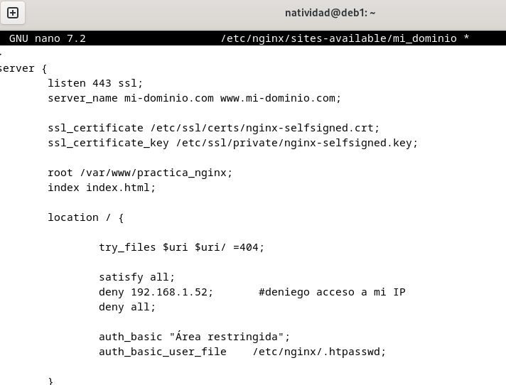

## Natividad Márquez Baena

# Práctica 2.2 – Autenticación en Nginx

1.[Introducción](#1)
2.[Paquetes necesarios](#2)
3.[Creación de usuarios y contraseñas para el acceso web](#3)
4.[Configurando el servidor Nginx para usar autenticación básica](#4)
5.[Probando la nueva configuración](#5)
6.[Combinación de la autenticación básica con la restricción de acceso por IP](#6)

## Introducción

En esta práctica se trabajará la autentificación básica HTTP para la gestión de acceso a un sitio web. Es una forma básica de autentificación para las aplicaciones web.

La autentificación básica permite que un servidor solicite credenciales, como usuario y contraseña, para acceder a la página y protegerla del acceso no autorizado. Al ser un tipo muy simple de autentificación, puede llegar a presentar problemas de seguridad.

## Paquetes básicos
Antes de realizar la práctica se requieren una serie de requisitos, como tener previamente instalado y configurado un servidor Debian remoto que funcione correctamente, con un dominio creado, ya que nos basaremos en el para la autentificacion básica.

Además se debe de contar con herramientas previamente instaladas como openssl, para crear contraseñas. Se obtiene mediante el comando `dpkg -l |grep openssl`.

## Creacion de usuarios y contraseñas para el acceso web

Se creará un archivo oculto llamado `.htpasswd` dentro del directorio /etc/nginx, donde se guardarán los usuarios y contraseñas que se crearán a continuación.

Primero se crea el usuario con un nombre y una contraseña.

También se creará otro usuario con el apellido.

A continuación se comprueba si el usuario y contraseña creados aparecen cifrados:

## Configurando el servidor Nginx para usar autenticación básica

Para la configuración del servidor se editará el bloque server block al cual queremos aplicar la restricción de acceso o autentificación.
Para ello se va a emplear el dominio previamente creado en la anterior práctica, `http://mi-dominio.com`.

Para ello abrimos el server block con el comando nano y lo editamos:

Se puede aplicar las restricciones a nivel de servidor o nivel local, siendo este en directorios especificos. Se empleará la directiva `auth_basic` a nivel de location y se añadirá el nombre del dominio donde se solicitarán las credenciales.

Por último se reinicia el sistema para que el servicio acepte los cambios y se integren.

## Probando la nueva configuración

Una vez completados los pasos anteriores se comprueba si ,efectivamente, cuando se trata de acceder a la aplicación web desde la máquina anfitriona, se requieren unas credenciales de usuario y contraseña para la autentificación.

De esta manera al introducirla se debería poder acceder. Si se niega la autentificación, saltará el siguiente mensaje de error.

Existe la posibilidad de acceder a los registros de acceso `(access.log)` y error a la aplicación `(error.log)`.

Tambien es posible aplicar la autentificación a una sección de la web, por ejemplo, la del portfolio. Para ello se modifica el bloque server block, correspondiente al archivo `contact.html`, de tal manera que:

Posteriormente se hace una comprobación para ver si la sintaxis es correcta:

Se debe obtener este mensaje antes de continuar.

## Combinación de la autenticación básica con la restricción de acceso por IP

Es posible combiar la autentificación básica con la restricción de acceso a una dirección IP, de forma efectiva, resultando un incremento de la seguridad la combinación de ambas.

Previamente se consulta la dirección IP desde donde se va a tratar de acceder. Después se abrirá el server block y se editará de tal forma que:

En la imagen, el apartado de `location` ha sido modificado haciendo el uso de `deny`.  Añadiendo la propia IP se le deniega la posibilidad de acceder, obteniendo el siguiente resultado:

Si accedemos al `error.log`, obtenemos este error, observando que efectivamente, se ha prohibido el acceso a la IP de la máquina anfitriona.

También es posible el caso contrario, donde la única IP permitida es la nuestra. Mediante el uso de allow se indica que nuestra IP tiene permiso para el acceso.

De esta manera se podrían combinar la autentificación HTTP junto con la restricción IP.

